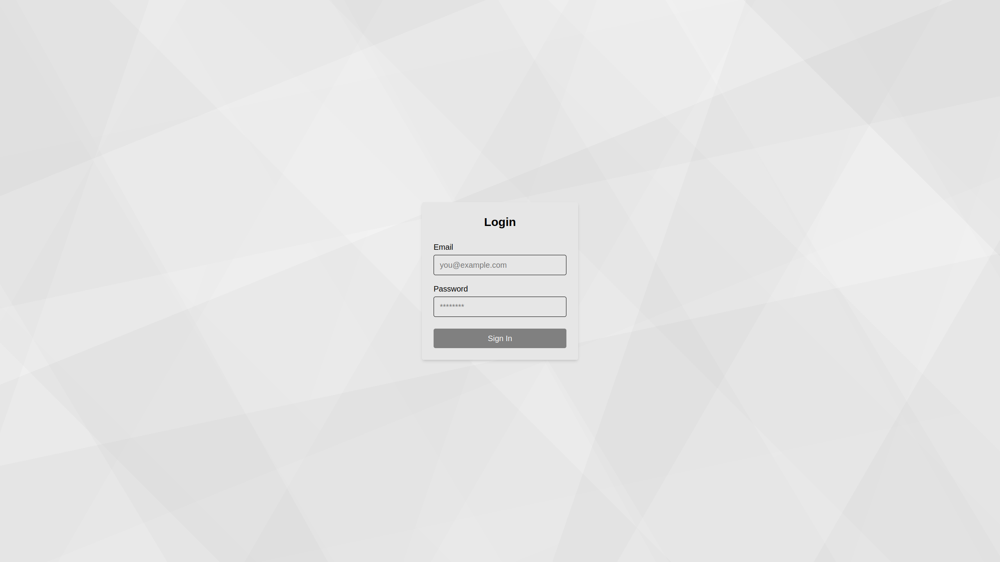
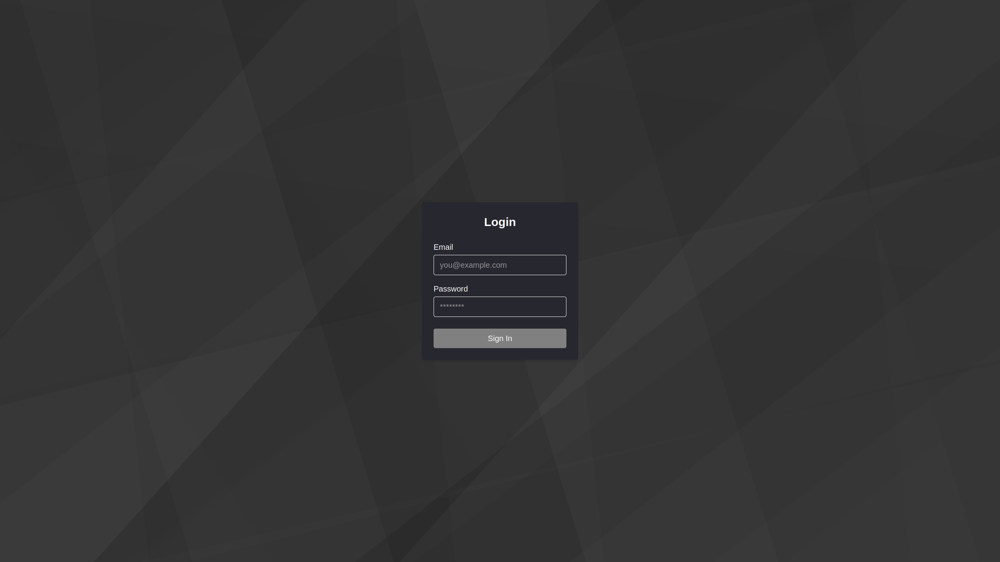

# Ultra Mobile Home

This requires ES 2017 and CSS variables browser support, which means browsers in the past 8 years
approximately. It can be shimmed or polyfilled to support older browsers if necessary.

## Features

* Ancillary Tool Scripts / Task Runners
* Automated Spellcheck
* Automatic Manifest Generation
* Automatic Robots.txt Generation
* Automatic Sitemap Generation
* Basic Authentication
* CSS Variable Theming
* Conventional Commits Linting
* Dark and Light Modes
* EditorConfig Support
* Gated Commits (overridden with --no-verify)
* Internationalization (i18n)
* Lint Config Overrides
* Next.js App Routing
* System Memory Checks
* Strict NVM and NPM Checks

### Light Mode



### Dark Mode



## Customizing

By default Next.js doesn't allow turning off an info message when linting. You can run this command
in Linux/Unix after an `npm i` to do just that.

```bash
grep -irl '`.*- Need to disable some ESLint rules?' \
  node_modules/next/dist/{esm,lib} | xargs \
  sed -i -e 's/`.*- Need to disable some ESLint rules?.*`/'\'\''/g'
```

## Project Folders

| Folder       | Description                             |
| ------------ | --------------------------------------- |
| `app`        | Application pages and API routes.       |
| `components` | Reusable components and HOCs.           |
| `context`    | Context providers.                      |
| `hooks`      | Reusable hooks.                         |
| `locales`    | Localization files.                     |
| `public`     | Static files that are public.           |
| `tests`      | Functional tests, mocks, and fixutures. |
| `tools`      | Ancillary scripts and runners.          |
| `types`      | Reusable project type defintions.       |
| `utility`    | Reusable utility routines.              |

_Note, the `tests` directory is for functional tests. Unit tests should reside next to the file
in which they are testing._

## Considerations

Once Pigment CSS (Zero-Runtime CSS-in-JS) becomes stable enough for the enterprise and compatible
with Turbopack, it should be considered as to remove the runtime performance hit of using styles
via JavaScript.

## Todos

* Add Accessibility Checks via Google Lighthouse (a11y)
* Ensure entire application is fully responsive.
* Add a global state container such as Redux.
* Add unit and functional tests to ensure code continuity.
* Add GitHub Workflow Actions to ensure gated checks are ran on the server.

## Notes

Next.js 15 requires Node.js 18+, but we default the minimum version to the latest LTS
release of 22.15 at the time of this writing, which includes support for things like
`import.meta.dirname`.

Also, the minimum supported version of TypeScript is 4.9 for Material UI 7. However, TypeScript
5.x should be used for projects as a general rule of thumb.
